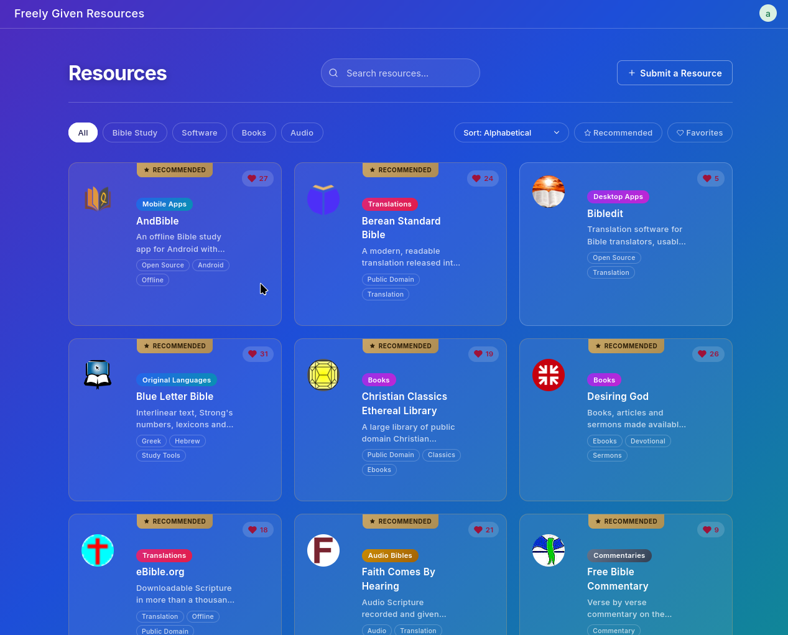
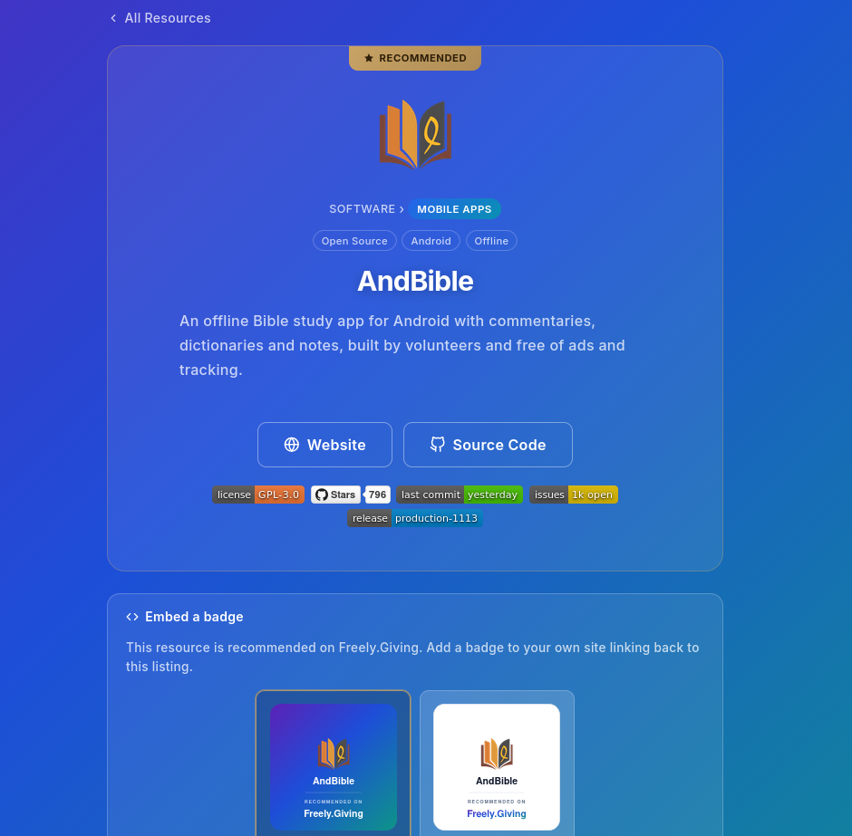
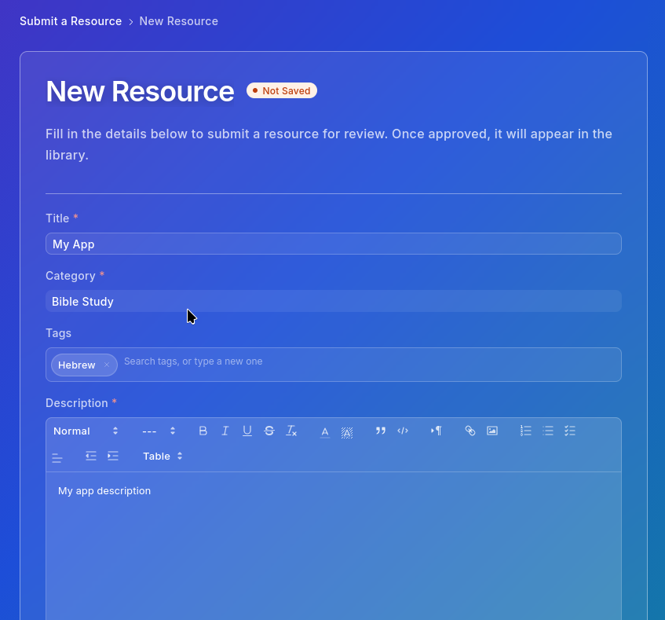
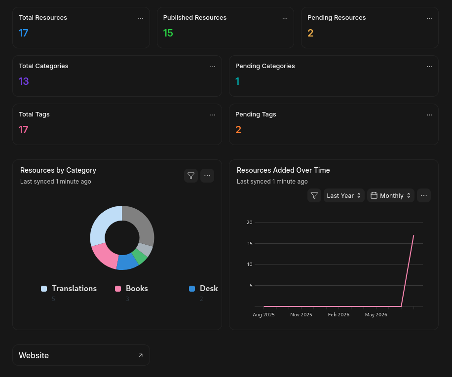

# Resource Library

A [Frappe](https://frappeframework.com/) app for collecting, curating and publishing freely given resources, built for [freely.giving](https://freely.giving).

[](license.txt)
[](https://github.com/meichthys/resource_library/stargazers)
[](https://github.com/meichthys/resource_library/commits)
[](https://github.com/meichthys/resource_library/issues)
[](https://github.com/meichthys/resource_library/releases)

## Screenshots

| Library Grid View | Resource Detail View |
| :---: | :---: |
| [](docs/screenshots/browse.png) | [](docs/screenshots/resource.png) |

| Submit a Resource | Admin Dashboard |
| :---: | :---: |
| [](docs/screenshots/submit.png) | [](docs/screenshots/workspace.png) |

## What it does

**Public site**

- A searchable, filterable library of resources, grouped by a category tree and cross cut by tags.
- Favourites and a curated "Recommended" flag, both usable as filters.
- Similar resources on every listing, ranked by shared tags first and category proximity second.
- Embeddable "Recommended on Freely.Giving" badges, generated on demand so they stop working the moment a resource is unpublished.

**Submissions**

- Anyone signed in can submit a resource, and see their own submissions with their approval status.
- Submitters can request tags and categories that do not exist yet. A requested category can be filed under an existing one and marked as able to hold subcategories.
- Requests stay pending until an admin approves them. Nothing pending appears on the public site, and a resource cannot be published while its category is unapproved.

**Administration**

- A workspace with review queues: total and pending counts for resources, categories and tags.
- Ownership transfer, so a resource an admin filed on someone's behalf can be handed to the person it belongs to.
- Software resources carry repository and app store fields, required and shown only for categories in the Software branch.

## Installation

Install with the [bench](https://github.com/frappe/bench) CLI:

```bash
cd $PATH_TO_YOUR_BENCH
bench get-app https://github.com/meichthys/resource_library --branch develop
bench --site $YOUR_SITE install-app resource_library
```

## Links

- [freely.giving](https://freely.giving), the site this app was built for
- [About](https://freely.giving/about) and [Why](https://freely.giving/why)
- [Publish](https://freely.giving/publish)

## License

[MIT-0](license.txt). No attribution required.

---

<a href="https://freely.giving">
  
</a>
